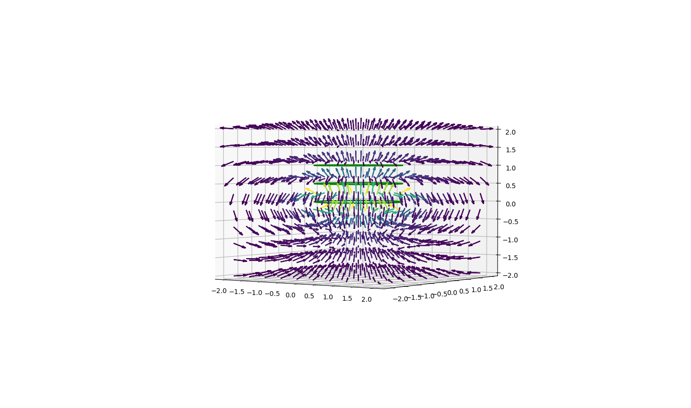
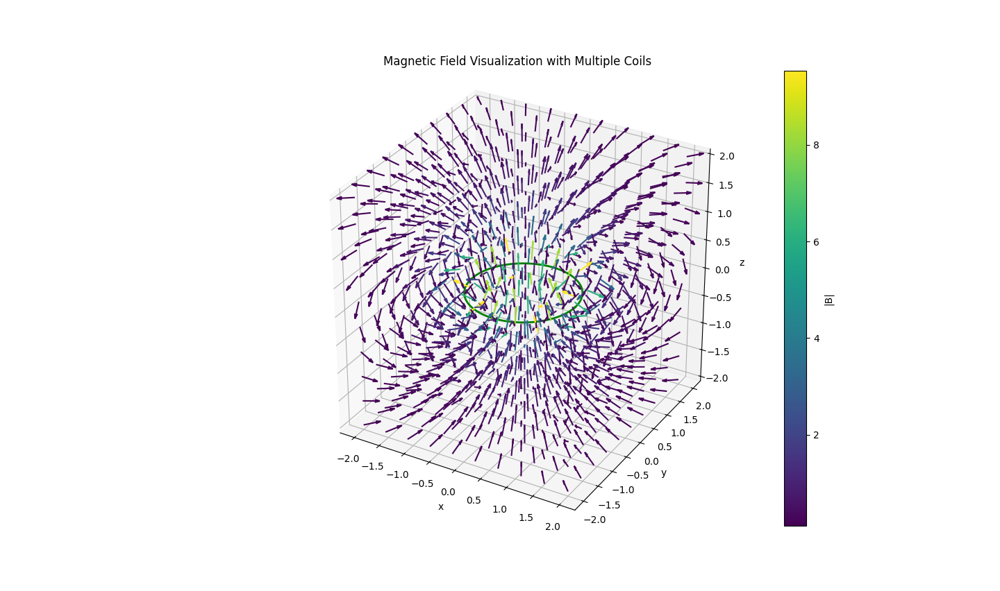
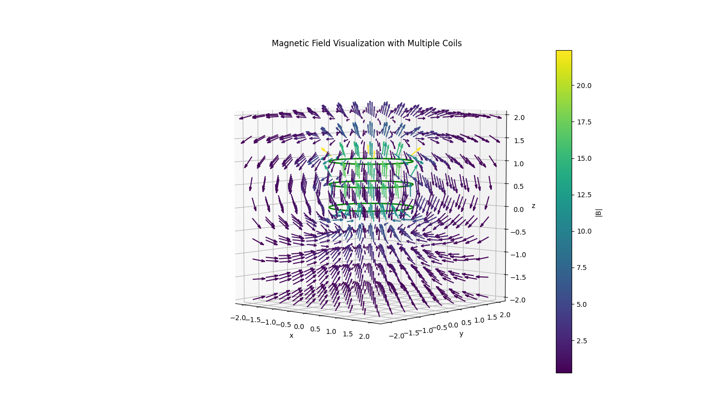

# README: Magnetic Field Simulation with Solenoid Coils

## Overview

This project simulates the magnetic field generated by a solenoid with multiple coils and visualizes it in 3D. Additionally, the Lorentz force acting on a charged particle within the field is modeled and animated to illustrate the particle's trajectory. The code leverages Python libraries such as `numpy`, `matplotlib`, and `sympy` for computations and visualizations.

  
*A 3D representation of the magnetic field created by current in solenoid coils.*

---

## Features

1. **Magnetic Field Visualization**  
   - Generates and visualizes the magnetic field created by multiple coils arranged in a solenoid configuration.
   - Magnetic field vectors are color-coded based on their magnitude for better interpretability.

2. **Lorentz Force Simulation**  
   - Models the motion of a charged particle in the magnetic field, demonstrating how its velocity changes due to the Lorentz force.
   - Produces a real-time 3D animation of the particle's trajectory.

3. **Interactive Toggle for Field Lines**  
   - A toggle button allows users to hide or display the magnetic field vectors for better focus on specific visual elements.

---

## Installation

1. Clone or download the repository.  
2. Ensure you have the required Python libraries installed. Install them with the following command:  
   ```bash
   pip install numpy matplotlib sympy scipy
   ```

---

## Usage

Run the Python script to generate the 3D magnetic field visualization and Lorentz force animation:
```bash
python lorentz3d_solenoid.py
```

During the visualization:
- Click the **Toggle Field** button to show or hide the magnetic field vectors.
- Observe the real-time animation of the particle's trajectory influenced by the magnetic field.

  
*Animation of the particle's motion influenced by the solenoid's magnetic field.*

---

## Code Details

### 1. Magnetic Field Generation
The solenoid's magnetic field is calculated by integrating contributions from each coil. The integration accounts for the Biot-Savart law, computed symbolically with `sympy` and numerically evaluated using `scipy`.

  
*A single coil generating part of the magnetic field.*

### 2. Lorentz Force Simulation
The Lorentz force equation is given by:

$\vec{F}=q(\vec{v} \times \vec{B})$

This equation is solved iteratively in the code to update the particle's velocity and position as it moves within the magnetic field.

### 3. Interactive Features
A toggle button is added for enabling or disabling the field vectors' display, offering a cleaner view of the particle's motion.

---

## Files

- `magnetic_field_simulation.py`: The main Python script.
- `images/`: Contains visual assets to illustrate the solenoid and field simulations.
  - `1coil.png`: Visualizes a single coil.
  - `3coil.png`: Shows a 3-coil configuration.
  - `3coil_solenoid.png`: Depicts the complete solenoid setup.
  - `solenoid.gif`: Animated particle motion in the solenoid field.
  - `solenoid2.gif`: Alternate animation of particle motion.

---

## Example Outputs

1. **3-Coil Solenoid Visualization**  
     

2. **Hypothetical Solenoid**  
     

---

## Future Improvements

- Optimize field computation for larger grids or higher-resolution visualizations.
- Add customization options for coil parameters (number of coils, spacing, etc.) and particle properties.
- Implement electric field effects alongside the magnetic field.
